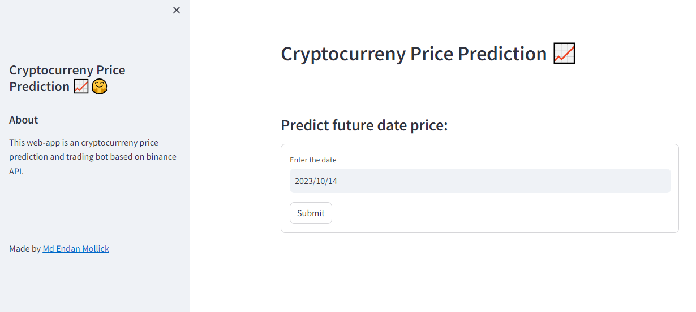

# Cryptocurrency Price Prediction App



This web application provides cryptocurrency price predictions and includes a built-in trading bot based on the Binance API. It allows users to make informed decisions regarding cryptocurrency investments.

## Features

- Predict Future Cryptocurrency Prices
- Automated Trading Signals with a Trading Bot
- User-friendly Interface
- Sidebar with Information About the App
- Easy Setup with Environment Variables

## Getting Started

1. **Prerequisites**: Ensure you have Python installed on your system.

2. **Environment Variables**: Set up the necessary environment variables `API_KEY` and `API_SECRET` for the Binance API.

3. **Installation**: Install the required packages by running the command:
   ```
   pip install -r requirements.txt
   ```

4. **Running the App**: Execute the app with:
   ```
   streamlit run app.py
   ```

5. **Usage**: Use the app to predict cryptocurrency prices and receive trading signals. Input a specific date to get price predictions.

## Contributing

Contributions to this project are welcome. Feel free to submit issues or pull requests.

## Author

- [Md Endan Mollick](https://github.com/MDENDAN)


---
_This project is not affiliated with Binance or any cryptocurrency exchange. Use it responsibly and at your own risk._
